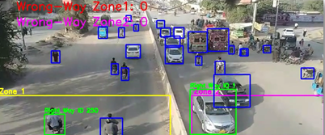
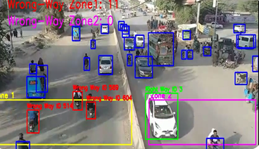
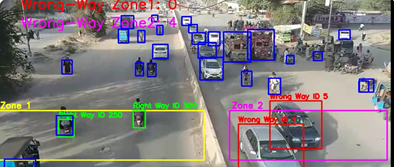

```markdown
# 🚦 Wrong-Way Vehicle Detection System using YOLOv8, OpenCV, and Flask

A real-time computer vision-based solution to detect wrong-way vehicle movement on single and dual-lane roads. This system is powered by a custom-trained YOLOv8 model and utilizes OpenCV for video processing, Flask for the backend server, and MongoDB for data storage.

---

## 📌 Description

This project detects wrong-way driving violations in live video feeds using a custom YOLOv8 model. It works for both single-lane and two-lane traffic. The system logs violations, stores them in a database, generates challans (tickets), and supports data annotation using Roboflow. A lightweight Flask server handles the backend.

---

## ✨ Features

- ✅ Detect wrong-way driving in **real-time**
- ✅ Works on **1-lane and 2-lane** traffic scenarios
- ✅ Uses **custom-trained YOLOv8 model** (via Ultralytics)
- ✅ Built-in **Flask** backend
- ✅ Save violations to **MongoDB**
- ✅ Auto-generate **challans**
- ✅ Annotation handled via **Roboflow**
- ✅ **OpenCV** for video feed and frame processing
- ✅ Tested on live webcam streams and video files

---

## 🧰 Technologies Used

- 🧠 **YOLOv8** – Ultralytics object detection
- 👁️ **OpenCV** – Image and video processing
- ⚙️ **Flask** – Lightweight backend server
- 💾 **MongoDB** – NoSQL database to store violation records
- 🖼️ **Roboflow** – Used for annotating training data
- 🌐 **HTML/CSS/JS** – For basic frontend rendering (optional)
- 🔑 **dotenv** – For environment variable management

---

## 📸 Screenshots

> All screenshots are located in the `static/` folder.






---

## ⚙️ Installation & Setup

Follow these steps to run the project locally:

### 🔹 1. Clone the Repository

```bash
git clone https://github.com/SyedAbdullahAhmed/FYP---Wrong-Way-Traffic-Detection-using-CV.git
cd FYP---Wrong-Way-Traffic-Detection-using-CV
```

---

### 🔹 2. Create and Activate Virtual Environment

```bash
# Create virtual environment
python -m venv venv

# Activate on Windows
venv\Scripts\activate

# OR on macOS/Linux
source venv/bin/activate
```

---

### 🔹 3. Install Required Python Packages

```bash
pip install -r requirements.txt
```

---

### 🔹 4. Install FFmpeg

#### On Windows:
- Download from: [https://ffmpeg.org/download.html](https://ffmpeg.org/download.html)
- Extract and add the `bin` folder path to **System PATH**

#### On macOS:
```bash
brew install ffmpeg
```

#### On Ubuntu/Debian:
```bash
sudo apt update
sudo apt install ffmpeg
```

---

### 🔹 5. Verify FFmpeg Installation

```bash
ffmpeg -version
```

You should see the version and config info if correctly installed.

---

### 🔹 6. Create `.env` File

In the project root directory, create a `.env` file and add the following:

```env
API_KEY=your_api_key_here
WORKSPACE_NAME=your_workspace_name
PROJECT_NAME=your_project_name
MONGODB_URL=your_mongodb_connection_string
```

---

### 🔹 7. Run the Application

```bash
python app.py
```

Visit in browser:

```
http://127.0.0.1:5000
```

---

## 📂 Project Structure (Sample)

```
your-repo-name/
│
├── app.py
├── requirements.txt
├── .env
├── README.md
└── ...
```

